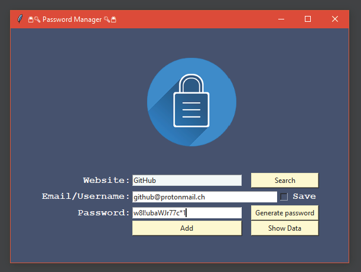
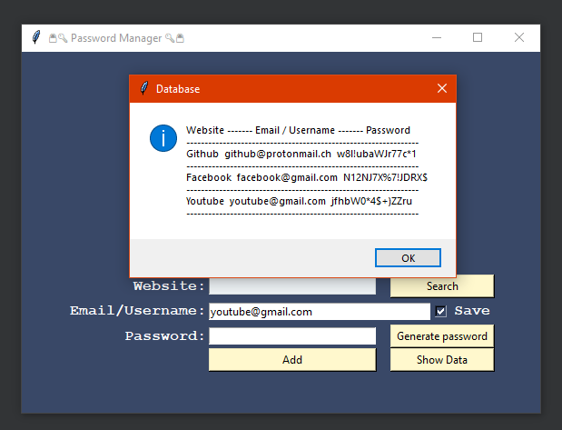
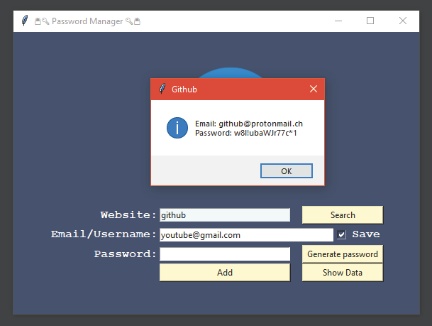

# 🔒🔑 Password Manager 🔑🔒

---

### Stored information:
* **🌐 Domain**
* **👤 Username / 📧 Email**
* **🗝️ Password**   

---
### Features
* **Generate password** button generates a new strong 
  password and copy it to clipboard
* **Save** checkbox will store email for next use
* **Show Data** button shows all login information  
* **Search** button search login information for given website  
* **Add** button will add new item in database
---

### GUI   

#### Lobby:

#### Show Data button clicked:

#### Search button clicked:
