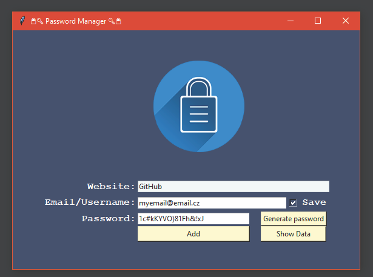

# 🔒🔑 Password Manager 🔑🔒

---

Offline Password Manager storing:
* **Domain**
* **Username / Email**
* **Password**   

---
### Features
* **Generate a password** generates a new strong 
  password and copy it  
* **Save** checkbox will store email for next use
* **Show Data** button opens data file 
with stored passwords
  
---  
# Bugs
* **Show Data** button currently not working
  * There are 3 parts in code you can edit and it'll work 
  for you on windows
    ```
    # Line 9, uncomment this line
    from os import startfile
    
    # Line 76 and 77, uncomment these 2 lines
    def show_data():
      startfile("data.txt")
    
    # Line 103 and 104, change these 2 lines by comment and uncomment the other   
    # show_passwords_button = Button(text="Show Data", width=14, bg=BLUE, command=show_data)  
    show_passwords_button = Button(text="Show Data", width=14, bg=BLUE)
    ```
  

---

### GUI   
   

